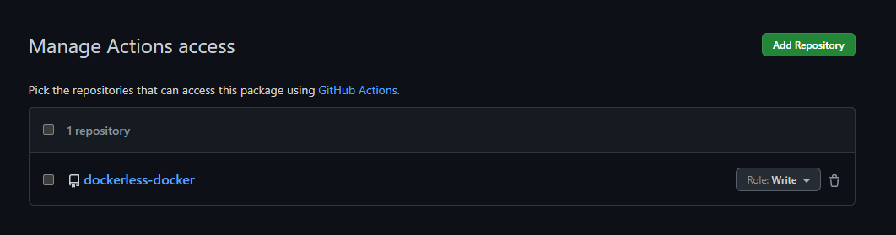

How to setup a github build action that uses the dockerless build in .Net 7

---

## Background

For me, one of the slowest parts of the fast build-test-deploy cycle was always waiting for docker builds to run. Especially with the practise of docker-in-docker builds which without special magic wouldn't cache anything, it could often take several minutes to create a docker application.
.Net 7 promises to offer an alternative to this for simple apps - let's take a dive in.

### Setup

You'll need .Net 7 for this, which isn't currently released at time of writing. However, in theory you can take a .Net 6 application and use the .Net 7 SDK to build it already, however YMMV.

With this installed, let's create a new app and get started! We're following along with https://devblogs.microsoft.com/dotnet/announcing-builtin-container-support-for-the-dotnet-sdk/ but with some changes

### Basic app

```bash
dotnet new webapi -o dockerless-docker
cd dockerless-docker
```

We also need to do a couple of things: because .Net 7 isn't out yet, we need a globals file to tell the github actions to use it

That gives us our basic app - let's add a github actions build for it now, by adding the following:
```json
{
    "sdk": {
        "version": "7.0.100-rc.2.22477.23"
    }
}
```

We'll also need to add a reference to this tool:
```bash
dotnet add package Microsoft.NET.Build.Containers
```

Now, add a github actions to ```.github/workflows/whatever.yml```

```yaml
name: Create and publish a Docker image

on:
  push:
    branches: [ "*" ]
  pull_request:
    branches: [ "main" ]


env:
  REGISTRY: ghcr.io
  IMAGE_NAME: ${{ github.repository }}

jobs:
  build-and-push-image:
    runs-on: ubuntu-latest
    permissions:
      contents: read
      packages: write

    steps:
      - uses: actions/checkout@v3
      - name: Setup .NET SDK
        uses: actions/setup-dotnet@v2
      # Package the app into a linux-x64 container based on the dotnet/aspnet image
      - name: Publish
        run: dotnet publish --os linux --arch x64 --configuration Release -p:PublishProfile=DefaultContainer
      - name: Checkout repository
        uses: actions/checkout@v3
      - name: Login to GitHub Container Registry
        uses: docker/login-action@v2
        with:
          registry: ghcr.io
          username: ${{ github.actor }}
          password: ${{ secrets.GITHUB_TOKEN }}
      - name: Tag built container with Github thing
        run: |
          docker tag dockerless-docker:1.0.0 ghcr.io/evolvedlight/dockerless-docker:1.0.0
      - name: Push built container to Github Package Repo
        run: |
          docker push ghcr.io/evolvedlight/dockerless-docker:1.0.0
```

Here's now where the weird bit comes - on github the process to get a repository seems rather backward. You need to assign permissions for the repo to write images, but there's no way to do that _until_ you've pushed an image manually!

So let's go around the hoops - create the docker image locally, tag it, login to the Github repository and upload it:

```
dotnet publish --os linux --arch x64 --configuration Release -p:PublishProfile=DefaultContainer
docker tag dockerless-docker:1.0.0 ghcr.io/evolvedlight/dockerless-docker:1.0.0
docker login ghcr.io -u <your username>
```

Enter a Personal access token that you can create on your github profile page, and finally push the image:

```
docker push ghcr.io/evolvedlight/dockerless-docker:1.0.0
```

Now go to your packages page, for me that's https://github.com/evolvedlight?tab=packages.
Click on the new package page that was created, and then go to the settings for it (for me https://github.com/users/evolvedlight/packages/container/dockerless-docker/settings)

Under "Manage Actions access" add your repository with access.

In the end it'll look like this:



Finally, rerun the action and it should work.

In the next blob post we'll look at fixing the above docker build to push with the right version numbers and tags